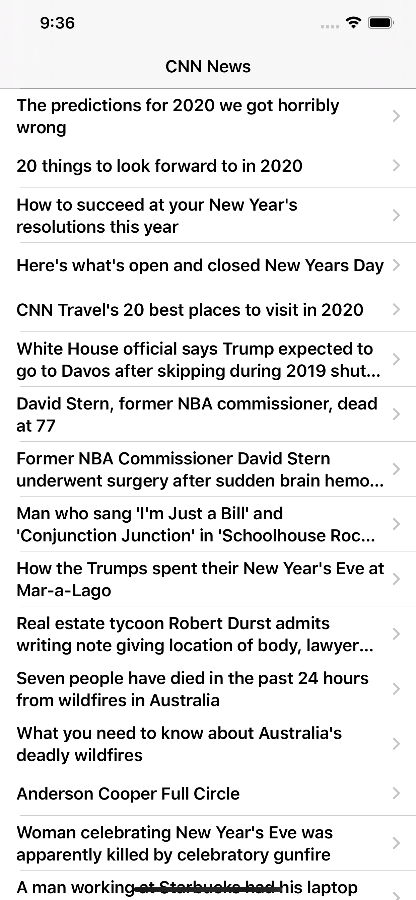
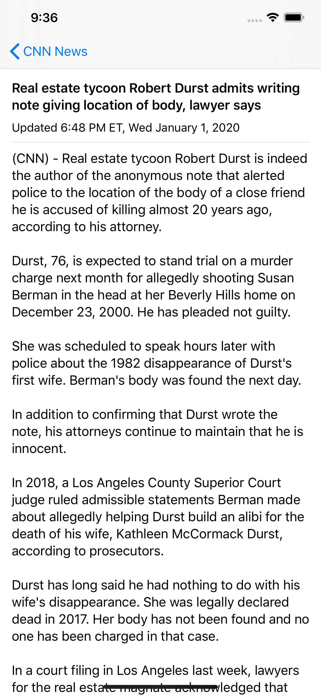

# CNN Mobile app 
* 2 screens: News List and News Detail
* fetch data from https://lite.cnn.io and parses the html with SwiftSoup
* SwiftUI

<table>
<thead>
	<tr>
		<th>News List View</th>
		<th>News Detail View</th>
	</tr>
</thead>
<tbody>
<tr>
<td>
	
</td>
<td>
	
</td>
</tr>
</tbody>
</table>
